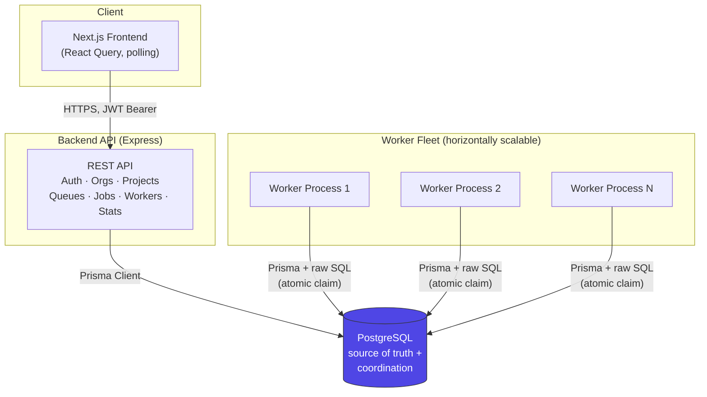
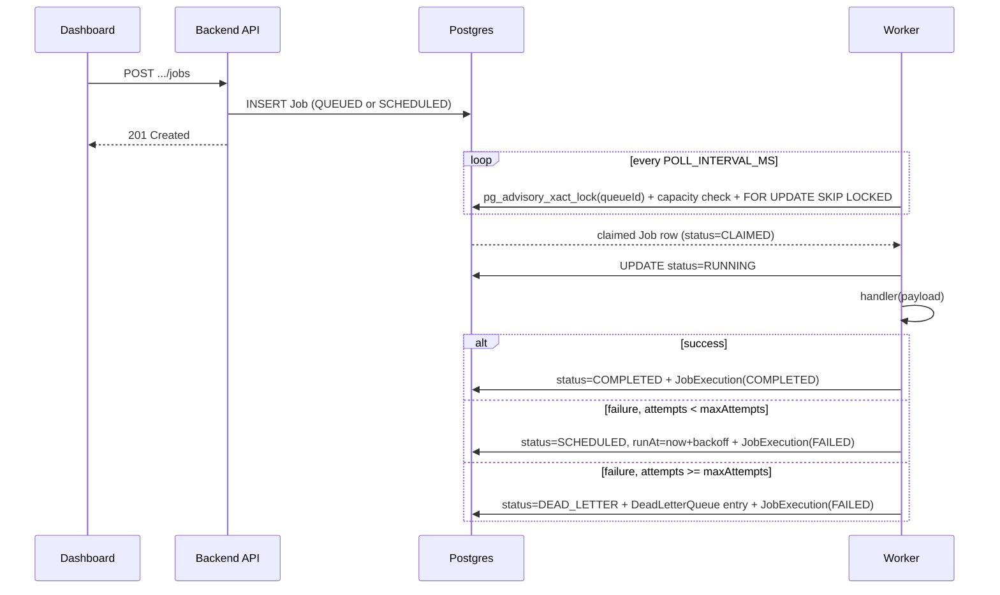

# Architecture

## System overview

Four independent processes coordinate through **one PostgreSQL database** — there is no message broker (no Redis, no RabbitMQ). Postgres *is* the queue: job state, locking, and coordination between workers all live in the same transactional store as the rest of the application's data. See [DESIGN_DECISIONS.md](DESIGN_DECISIONS.md#no-message-broker) for why.



**The API and the workers never talk to each other directly.** The API writes `Job` rows; workers poll for claimable rows and update them. This means:
- Adding worker capacity is just starting another worker process — no service discovery, no load balancer config.
- The API can be down while workers keep draining the queue, and vice versa.
- The only shared coupling is the database schema, versioned in one place (`packages/db`) and imported by both.

## Monorepo layout

```
backend/     Express REST API
worker/      Background job processor (no HTTP surface)
frontend/    Next.js dashboard
packages/db/ Prisma schema + generated client — the ONE schema both services depend on
```

`packages/db` exists specifically because `backend` and `worker` both read/write the same tables. A shared package (not two copies of the schema) guarantees they can never drift out of sync with each other — see [DESIGN_DECISIONS.md](DESIGN_DECISIONS.md#shared-prisma-package) for the trade-off (both services are now coupled to one Prisma version).

## Request → execution flow

The sequence from "user submits a job" to "job either completes, retries, or dead-letters" — the core reliability loop the whole system is built around:



Full detail on the atomic-claim query (and the concurrency bug it took two rewrites to get right) is in [DESIGN_DECISIONS.md](DESIGN_DECISIONS.md#atomic-job-claiming).

## Worker internals

Each worker process runs three independent loops on its own timers:

| Loop | Interval (env var) | Responsibility |
|---|---|---|
| Poll/claim | `POLL_INTERVAL_MS` | For each unpaused queue (priority order), atomically claim up to its remaining local concurrency slots, dispatch each claimed job to the execution pool |
| Heartbeat | `HEARTBEAT_INTERVAL_MS` | Update `Worker.lastSeenAt` + insert a `WorkerHeartbeat` row (liveness signal, read by the dashboard's health indicator) |
| Recurring dispatch | `RECURRING_CHECK_INTERVAL_MS` | Find due `RecurringJob` definitions, race-safely advance each one's `nextRunAt`, spawn a `Job` |

Concurrency inside one worker process is a simple in-memory slot count (`WORKER_CONCURRENCY` minus currently-running job promises) — no thread pool, since job handlers are async I/O-bound functions running on Node's event loop, not CPU-bound work.

Graceful shutdown (`SIGINT`/`SIGTERM`): stop claiming new jobs → mark the worker `DRAINING` → wait for in-flight jobs to finish (bounded by `SHUTDOWN_TIMEOUT_MS`) → mark `OFFLINE` → exit.

## Frontend

The dashboard is entirely client-rendered (`'use client'` components + React Query), not server-rendered. The JWT lives in `localStorage` and is attached as a Bearer header to every API call. Live data (job lists, queue stats, worker health) updates via polling (`refetchInterval`), which the assignment explicitly allows as an alternative to WebSockets. See [DESIGN_DECISIONS.md](DESIGN_DECISIONS.md#client-rendered-dashboard) for why SSR wasn't worth the complexity here.
