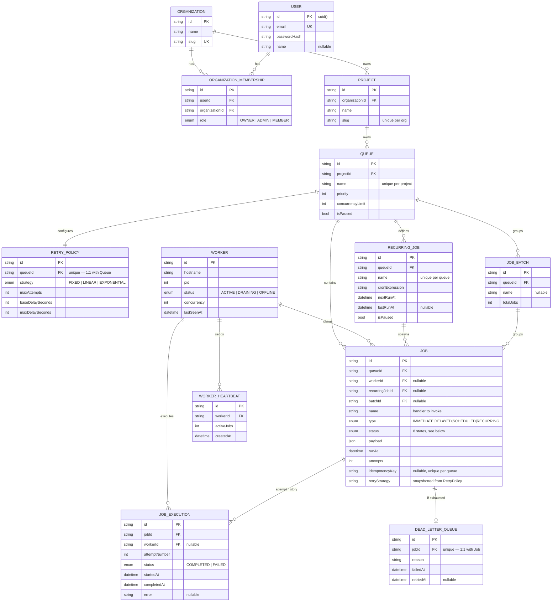

# Entity-Relationship Diagram

Full schema: [`packages/db/prisma/schema.prisma`](../packages/db/prisma/schema.prisma). This document explains the *why* behind the shape — primary keys, cascades, indexes, and normalization choices — not just the *what*.

## Primary keys: `cuid()` everywhere

Every table uses Prisma's `cuid()` rather than an auto-incrementing integer or a random UUIDv4:

- **Not autoincrement** — a sequential integer PK reveals row counts/ordering to anyone who sees an ID (`/jobs/4` tells you there are ~4 jobs), and doesn't support ID generation without a round-trip to the DB — a real limitation for a system explicitly meant to be distributed.
- **Not plain UUIDv4** — a `cuid()` is shorter, and (unlike pure-random UUIDs) is roughly time-sortable, which keeps B-tree index locality better as tables grow. UUIDv4's outputs are uniformly random, which is exactly what causes index page fragmentation at scale.

## Why `OrganizationMembership` is an explicit join model, not implicit many-to-many

A user can belong to multiple organizations, and each membership needs an attribute (`role`) that belongs to *the pairing*, not to the user or the org individually. Prisma can only express many-to-many *implicitly* when there's nothing extra to attach to the relationship — the moment a per-pair attribute like `role` exists, an explicit join model is required. This also means adding full RBAC later needs zero schema changes.

## Retry policy: snapshotted onto `Job`, not a live foreign key

`Job.retryStrategy/maxAttempts/baseDelaySeconds/maxDelaySeconds` are copied from the queue's `RetryPolicy` at creation time (with an optional per-job override), not read live via a join at execution time. If an operator edits a queue's default retry policy, jobs already in flight keep using the policy that was in effect when they were created — editing a queue's config should not retroactively change the behavior of jobs someone already submitted.

## Two index decisions, same underlying rule

Postgres's left-prefix rule — a composite index on `(A, B)` optimizes lookups by `A` alone for free, but not lookups by `B` alone — was applied deliberately, in opposite directions, twice:

- `OrganizationMembership` has `@@unique([userId, organizationId])`. Since the common query "list all members of org X" filters by the *second* column, a separate `@@index([organizationId])` was added.
- `Queue` has `@@unique([projectId, name])`. Since "list all queues in project X" filters by the *first* column, no extra index was added — it would have been redundant.

## `RecurringJob`, not "ScheduledJob"

The assignment's DB-design language calls this entity "Scheduled Jobs," but that name was already taken: `Job.type = SCHEDULED` means a one-time job with a future `runAt`, which is a different concept from a repeating cron template. `RecurringJob` avoids the collision.

## `JobExecution`: append-only attempt history, separate from `Job`

`Job` only ever holds the *latest* attempt's denormalized fields (`lastError`, `startedAt`, `completedAt`) — that's enough for "what's happening right now." `JobExecution` is a separate append-only table, one row per attempt, because the assignment explicitly requires "retry history" as a first-class, queryable thing (a dashboard "execution log" view needs every attempt, not just the most recent one).

## Cascades

Everything under an `Organization` cascades on delete: `Organization → OrganizationMembership/Project → Queue → RetryPolicy/Job/RecurringJob/JobBatch → JobExecution/DeadLetterQueue`. Deleting a tenant's organization cleanly removes all of its data in one operation, with the database enforcing referential integrity rather than the application code.

`Job.workerId`, `Job.recurringJobId`, and `Job.batchId` are `onDelete: SetNull` instead: if a `Worker` row is pruned, a `RecurringJob` definition is deleted, or — well, a batch can't currently be deleted — the `Job` rows they reference should survive as historical records, just losing that particular cross-reference. Business/audit data (a job that ran) shouldn't disappear because an operational record (which worker happened to run it) did.
